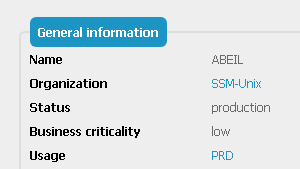
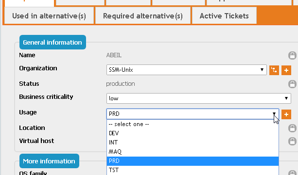
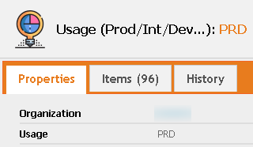
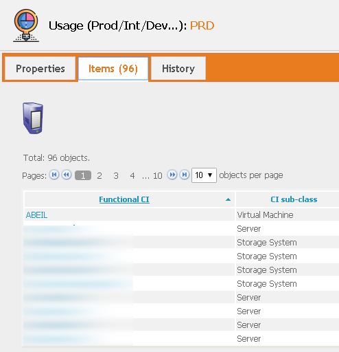

# iTop-Usage-Class
Adds an Usage Category to any object. In my case, that's Production/Dev/Test...

# Goal
In our environment, we like to know in a glance if a resource is a production ressource, or a Dev resource, or a test device.
Instead of creating another text field in my objects, I choose to create a new class, so :

1) The number of category is (normally) limited

2) It's also possible to do a search starting from the category (all production items, for example)

For example, for a Virtual Machine, you see that :

In case of Edition, you can only choose a predefined usage (or Create a new one) :

In the Usage View, you can see all items for the same Usage :

A this time, while this class is technically available for most if not all other classes, I only added it in the 'Server', 'Storage Devices' and 'Virtual Machine' screen. Don't hesitate to ask for more items, I think that every CIs should have this field (but time is always short...)

Hope this can be useful for other :)

And : "iTop Rocks" (never miss an occasion to tell that :-))

# Installation
As for all my extensions, just download the zip file, and copy the 'schirrms-...' directory in your extensions directory, then rerun the setup as usual.